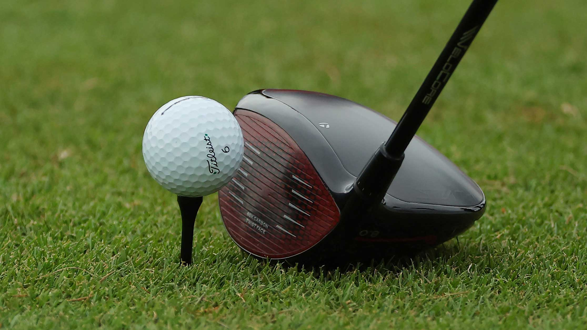

```{r setup, include=FALSE}
knitr::opts_chunk$set(echo = TRUE)
library(tidyverse)
library(knitr)
library(ggfortify)
library(emmeans)
library(ggplot2)
```


## Problem 1

**Description**: Golf is one of the most popular recreational sports in the United States.
The *driver* is one of the more important clubs as a golfer will use it when wishing to hit the ball off a tee for very long distances.  

The act of hitting a golf ball requires precision, skill and strength but the club (the driver, in this case) can influence a shot as well.
A golf manufacturer is looking to improve their product line of golf drivers.
Four protoype drivers

* Driver 1: mass of 270g and a length of 117.5cm
* Driver 2: mass of 290g and a length of 116.2cm
* Driver 3: mass of 310g and a length of 115.0cm
* Driver 4: mass of 340g and a length of 113.4cm

The manufacturer recruited 6 different golfers to test each of the four drivers. 
Each golfer used each driver once, in a random order, and the manufacturer recorded several variables related to the shot. 
Of particular interest to the manufacturer is determining if certain drivers result in longer distance shots. The distance of shots is stored in variable *totdist*.

### Read Data

Data Entry and processing

```{r}
golf_data <- read.csv("golf_driver.csv")
golf2=golf_data%>%
  select(driver,golfer,totdist)
glimpse(golf2)
```

### Part 1

Identify the following design elements in this study: the experimental units, the response variable(s), the factor, factor levels, the treatments. What did the experimenters do to control variability?

* **experimental units:** **The expeirmental units are the the golf shots**

* **response variable:** **The response variable is the distance that the golf ball travels**

* **If there is any confounding variable, What is it? How is it controlled?** **Golfer could be a confounding vartiable, as the implications of the differences between golfers are limitles, ok, they are not limitless perse, however, for example, some golfers are likely more experienced than others, some golfers also lift heavier weights than others, impacting how far the golf ball travels when they swing**

* **the factor:** **The Driver**

* **factor levels:** **There are 4 factor levels**

* **treatments:** **Driver 1, Driver 2, Driver 3, Driver 4**

* **What other steps were taken to control for nuisance variables and unexplained variability?****Randomization, and the fact that each golfer only used each driver once**


### Part 2

(Data Cleaning) Create a reduced data set that only contains the variables we need. Convert any variables to factors if needed, using meaningful factor labels where possible. 

```{r}
golf2 <- golf2 %>%
  mutate(driver = as.factor (driver),
         golfer=as.factor(golfer)) 
glimpse(golf2)
```


### Part 3

What type of analysis makes the most sense for this study design? How do the factors in this study fit into this design? Justify your choice.

**The type of analysis that makes the most sense for this study design is a profile plot, which explores the effects of, in this situation, the four treatments, on the total distance, and among each golfer, since golfer is the extra variable that I chose to include in my statistical analysis**


### Part 4

(EDA) Create an appropriate plot for visualizing this data set. You must use meaningful labels in this plot. Describe your observations based on the plot. 


```{r}
ggplot(golf2) + 
  geom_line(aes(x=driver, y=totdist, color=golfer, group=golfer)) +
  geom_point(aes(x=driver, y=totdist, color=golfer, group=golfer)) +
  labs(x="Driver",y="Total Distance of Shot (Yards) ")

golf2 %>%
  group_by(driver) %>%
  summarize(Mean=mean(totdist),
            SD=sd(totdist),
            Var=var(totdist),
            N=n()  ) %>%
  kable()


```

**One may come to the conclusion that golfer 3. is the most experienced out of the 6, the driver used also does not seem to impact distance the ball traveled by a whole lot**

### Part 5

Fit the appropriate model for this study. Check the assumptions of this model. You need to provide your graphs and your comments about the model assumptions based on your findings from these graphs.

```{r}
golf.anova <- aov(totdist ~ golfer + driver, data=golf2)
summary(golf.anova)
autoplot(golf.anova)
```

**I did not observe a normal assumption, as the graoh varies too greatly to come to that determination**


### Part 6

Explain your results, citing the test statistic(s), degrees of freedom, and the p-value(s). What are your conclusions in the context of the problem? **Use the significant level $\alpha=0.01$**


**With a p-value of 0.0254, df of 3, f-stat of 4.13, we have sufficient evidence that the driver used has an impact on how far the golf ball was hit**

### Part 7

If necessary, perform multiple comparisons and explain the results. If multiple comparisons are not necessary, explain why.

```{r}
golf2.mc <- emmeans(golf.anova,"driver")
confint(contrast(golf2.mc, "pairwise"))
plot(contrast(golf2.mc, "pairwise"))
```
**At face value, without any context, the distance the ball traveled is not too different when you compare the drivers to each other, but, in golf, distance matters, therefore, there is a differnece, not a large difference, but the differences are vital to performance, which is not something that we are not measuring in this situation.**


## Problem 2

**Description**: Suppose you wished to investigate the effect of Seam Type (levels: Flat-Felled Seam, French Seam) and Sewing Machine Speed (levels: Very Low, Low, Medium, High, Very High) on the Seam Strength (pounds) of a particular garment. A total of 30 similar garment samples were considered, where the same fabric type, thread type, thread thickness, and sewing machine was used for all samples. Three samples were randomly assigned to each treatment. The dataset is in file `Seam_Strength.csv`.

### Part 1

Identify the following design elements in this study: the experimental units, the response variable(s), the factor, factor levels, the treatments. What did the experimenters do to control variability?

* **experimental units:** **The particular garment that is having the seam strength measured on**

* **response variable:** **Seam Strength is the response variable**

* **the factors:** **The factors are Seam type and Sewing machine speed.**

* **factor levels:** **Seam type has 2 levels, Sewing Machine Speed has 5 levels**

* **treatments:** **Flat-Felled Seam, French Seam, Very low, low, medium, high, and very high sewing machine speed.**

* **What steps were taken to control for nuisance variables and unexplained variability?** **Random Assignment was implemented**

### Part 2

Reorder the levels of `Sewing_Speed` for a proper visualization, and omit the `Replicate` variable.

```{r}
Seam <- read.csv("Seam_Strength.csv")
glimpse(Seam)


Seam2=Seam %>%
  select(Seam_Type, Sewing_Speed, Seam_Strength)
glimpse(Seam2)

Seam2 <- Seam2 %>%
  mutate(Sewing_Speed = as.factor(Sewing_Speed),
         Seam_Type=factor(Seam_Type, labels=c("Flat", "French")))
glimpse(Seam2)
```

### Part 3

(EDA) Create an appropriate plot for visualizing this data set. You must use meaningful labels (no underscores!) in this plot. Describe your observations based on the plot. (Hint: To make a meaningful Legend Title, use `labs(color="Legend Title")`).

```{r}
ggplot(Seam2, aes(x=Sewing_Speed,y=Seam_Strength, color=Seam_Type, group=Seam_Type)) +
  stat_summary(fun=mean, geom="point") +
  stat_summary(fun=mean, geom="line") +
  labs(y="Change in Seam Strength (Pounds)",x="Sewing Speed") +
  theme_bw()
```

**For the most part, there is little to no difference in Seam Strength among the Seam types \**

### Part 5

Fit the appropriate model for this study. Check the assumptions of this model. You need to provide your graphs and your comments about the model assumptions based on your findings from these graphs.

```{r}
Seam.anova <- aov(Seam_Strength ~ Sewing_Speed + Seam_Type + Sewing_Speed:Seam_Type, data=Seam2)
autoplot(Seam.anova)
summary(Seam.anova)

```

**It is a normal assumption, from what I observed from the graph above** 


### Part 6

Completely investigate the effects of interest using Analysis of Variance.  Explain your results, citing the test statistic(s), degrees of freedom, and the p-value(s). What are your conclusions in the context of the problem?


**With a p-value of 0.000138, f-stat of 9.903, df of 4, we have sufficient evidence to concludue that the relationship between Sewing Speed and Seam Type is significant.** 


### Part 7

If necessary, perform multiple comparisons and explain the results. If multiple comparisons are not necessary, explain why.

Since the interaction term IS significant, we should do conditional multiple comparisons. Since Sewing Speed has the largest number of factor levels, condition on the other factor (Seam Type)

```{r}
Seam2.mc <- emmeans(Seam.anova, ~ Sewing_Speed | Seam_Type)
contrast(Seam2.mc, "pairwise")
```

**Low and very Low sewing machine speeds are not significant, evrything else is, the variation between the seam types within is roughly the same, roughly the same deviation**


